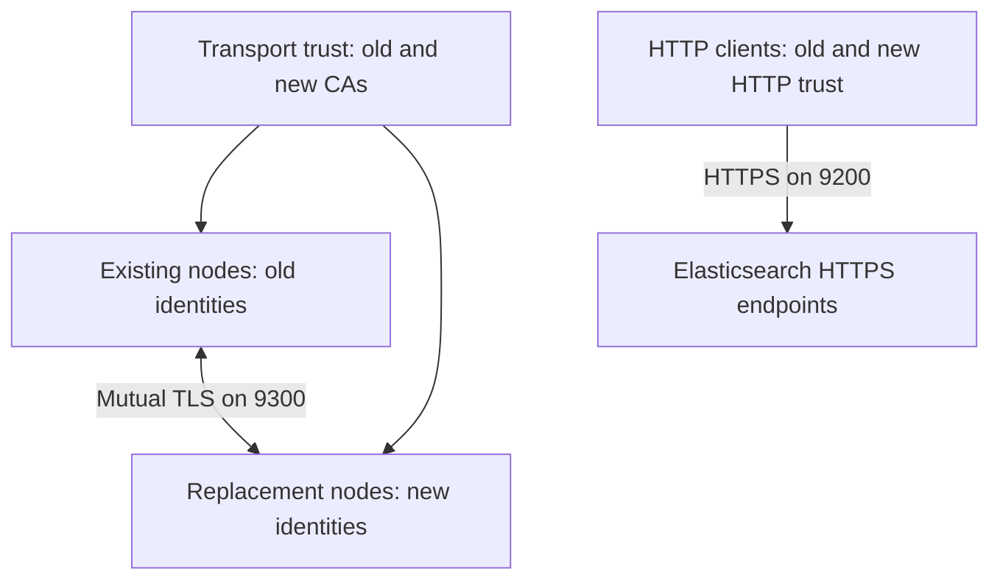

# Migrating an Elasticsearch cluster with manually managed TLS

I worked on a cluster that had started on Elasticsearch 7.x and was already running 8.17.0 when we needed replacement nodes. Its security had been configured manually. The task was to bring new nodes into the existing cluster while introducing new certificate material.

The first replacement joined and the cluster returned to green. I treated that as a milestone: membership and shard health were working. Client trust, retained nodes, and removal of the old certificates still needed their own checks.

This guide reconstructs a reusable procedure from that experience. It uses fictional addresses and names, and keeps node replacement separate from a software upgrade.

## Contents

1. [Choose the right migration path](#1-choose-the-right-migration-path)
2. [Capture the baseline and recovery options](#2-capture-the-baseline-and-recovery-options)
3. [Inspect certificates before restarting anything](#3-inspect-certificates-before-restarting-anything)
4. [Create the new identities and overlapping trust](#4-create-the-new-identities-and-overlapping-trust)
5. [Teach existing nodes to trust the new CA](#5-teach-existing-nodes-to-trust-the-new-ca)
6. [Configure and join a replacement node](#6-configure-and-join-a-replacement-node)
7. [Move shards and retire data nodes](#7-move-shards-and-retire-data-nodes)
8. [Handle master and coordinating nodes](#8-handle-master-and-coordinating-nodes)
9. [Move HTTP clients](#9-move-http-clients)
10. [Finish certificate rotation and remove old trust](#10-finish-certificate-rotation-and-remove-old-trust)
11. [Handle expired legacy certificates separately](#11-handle-expired-legacy-certificates-separately)
12. [Troubleshooting and rollback](#12-troubleshooting-and-rollback)
13. [Completion checklist and lessons](#13-completion-checklist-and-lessons)

## 1. Choose the right migration path

This is an **existing-cluster node replacement and CA rollover**. New nodes join the same cluster UUID. It is not a procedure for merging two clusters, copying data directories, or upgrading directly between arbitrary major versions.

The examples follow the Elasticsearch 8.17 configuration model because that was the version involved. Its documentation is archived. Use documentation for the version you actually operate, and plan supported software upgrades as a separate change. Install replacement nodes at the existing cluster's version with compatible plugins; do not install an unpinned latest package.

The enrollment-token command is intended for clusters configured through Elasticsearch's security auto-configuration. Turning on an enrollment setting in a manually secured cluster does not recreate that initial setup. For this case, configure discovery, certificates, trust, and credentials explicitly. See [Elastic's enrollment-token prerequisites](https://www.elastic.co/docs/reference/elasticsearch/command-line-tools/create-enrollment-token).

### Two TLS planes

| Plane | Typical port | Peers | What must trust the new issuer |
|---|---:|---|---|
| Transport | 9300 | Elasticsearch nodes | Every participating node |
| HTTP | 9200 | Kibana, ingestion, applications, monitoring | Every connecting client, and any TLS-terminating intermediary as appropriate |

Transport uses mutual TLS. A node is both a TLS client and a server. Configuring trust only on the replacement node leaves the other direction unresolved.

A working HTTPS request says nothing conclusive about transport TLS. A green cluster says nothing conclusive about a Kafka connector's ability to reconnect.



The steady transition is:

| Stage | Identities presented | Trust available |
|---|---|---|
| Baseline | Old certificates | Old CA |
| Prepare | Old certificates | Old and new CAs |
| Migrate | Mixture of old and new certificates | Old and new CAs |
| Complete | New certificates everywhere in scope | New CA |

This normal sequence assumes valid certificates and chains. If legacy material is expired, read section 11 before any restart.

### Reading the examples

Shell blocks run on the indicated signing workstation, node, or client. HTTP blocks use Kibana Dev Tools Console syntax. They are individual operations with checks between them, not one script to paste and run.

The example uses `search-lab`, `hot-old-01`, `hot-new-01.lab.example.com`, and documentation address `192.0.2.31`. Replace them consistently. Commands assume Linux package paths and an authorized operator account. Keep credentials out of Git, shell arguments, tickets, and terminal transcripts.

## 2. Capture the baseline and recovery options

Before changes, save these responses securely:

```http
GET /
GET /_cluster/health
GET /_cat/nodes?v&h=id,name,ip,node.role,master,version
GET /_nodes/settings,plugins
GET /_cluster/settings?include_defaults=true&flat_settings=true
GET /_cat/allocation?v
GET /_cat/shards?v
GET /_cluster/pending_tasks
GET /_all/_settings?flat_settings=true
```

Record the cluster UUID, exact version, node IDs and roles, plugins, transport publish addresses, seed hosts, license requirements, and which endpoints clients actually use. Save the original persistent **and transient** settings: a transient value can override your persistent change.

Review index replicas, tier preferences, allocation filters, awareness attributes, disk watermarks, shard limits, and available recovery bandwidth. The remaining nodes need room for the shards and workload after each retirement. A new node in the wrong tier or awareness domain may be unable to receive them.

Inventory Kibana, Kafka Connect, Logstash, Beats, applications, monitoring, backup tools, load balancers, and remote-cluster connections. Record their owners, trust files, authentication method, reload behavior, and configured endpoints.

Back up each node's configuration and Elasticsearch secure keystore using your protected backup process. Record file ownership and permissions. A cluster snapshot does not back up node configuration or certificate files.

### Snapshot checkpoint

Use an already configured repository. These names are examples:

```http
POST /_snapshot/migration-backups/_verify

PUT /_snapshot/migration-backups/pre-node-migration-001?wait_for_completion=true
{
  "include_global_state": true
}

GET /_snapshot/migration-backups/pre-node-migration-001
```

Require a successful snapshot with the intended indices and feature states included. Understand how restoring security state affects authentication. Repository verification alone does not prove restore readiness; have a compatible restore destination and a known recovery procedure. If the request times out, inspect the snapshot before retrying.

Snapshots capture shards over a time interval, not one atomic application-wide instant. Coordinate application consistency where required. See [Elastic's snapshot guidance](https://www.elastic.co/guide/en/elasticsearch/reference/8.17/snapshots-take-snapshot.html).

**Gate:** a documented baseline, usable recovery path, healthy cluster, sufficient capacity, and adequate master quorum. Investigate existing red/yellow health rather than attributing it later to the migration.

## 3. Inspect certificates before restarting anything

On every node, inspect the active configuration and certificate files. Distinguish:

- An identity keystore containing a node's private key and certificate chain.
- A truststore containing trusted public certificates.
- A CA signing keystore containing a CA private key, which belongs on a controlled signing system.

File names such as `elastic-certificates.p12` do not establish which role a file serves.

```bash
keytool -list -v -storetype PKCS12 -keystore /secure-staging/legacy-node.p12
openssl x509 -in /secure-staging/transport-ca-old.pem -noout \
  -subject -issuer -serial -dates -fingerprint -sha256
```

For a PEM leaf certificate, also inspect its Subject Alternative Names:

```bash
openssl x509 -in /secure-staging/legacy-node.crt -noout \
  -subject -issuer -dates -ext subjectAltName
```

Check the full chain, expiry, key usage, extended key usage if present, and names/IPs actually used for connections. Transport identities must work in both client and server roles. Check system time.

Query the certificate API **directly on each node**:

```http
GET /_ssl/certificates
```

This is node-local information. Repeating it through one load balancer is not a reliable inventory of the cluster. An existing connection can continue while a fresh TLS handshake fails, so inspect validity before you depend on a restart.

**Gate:** the normal rollover can proceed only if the old identities remain usable throughout the overlap and rollback window. Inventory retained masters and coordinating nodes as carefully as data nodes.

## 4. Create the new identities and overlapping trust

Use your organization's PKI if available. The commands below show a small example using separate transport and HTTP CAs. An enterprise hierarchy may involve intermediate issuers and additional chain distribution.

On a protected signing workstation with the matching Elasticsearch tools:

```bash
umask 077
mkdir -p es-migration-certs
cd es-migration-certs

/usr/share/elasticsearch/bin/elasticsearch-certutil ca \
  --ca-dn "CN=Search Lab Transport CA" \
  --days 1825 --out transport-ca-new.p12

/usr/share/elasticsearch/bin/elasticsearch-certutil ca \
  --ca-dn "CN=Search Lab HTTP CA" \
  --days 1825 --out http-ca-new.p12

openssl pkcs12 -in transport-ca-new.p12 -nokeys -out transport-ca-new.pem
openssl pkcs12 -in http-ca-new.p12 -nokeys -out http-ca-new.pem
```

Use prompted strong passwords and store them in the approved secret system. The lifetimes are examples; choose them according to policy, renewal capability, and issuer validity. The exported PEM files contain public material. The CA `.p12` files contain signing keys and must not be copied to Elasticsearch nodes or committed.

Issue distinct identities for each node:

```bash
/usr/share/elasticsearch/bin/elasticsearch-certutil cert \
  --ca transport-ca-new.p12 \
  --name hot-new-01 \
  --dns hot-new-01.lab.example.com,hot-new-01 \
  --ip 192.0.2.31 \
  --days 365 --out hot-new-01-transport.p12

/usr/share/elasticsearch/bin/elasticsearch-certutil cert \
  --ca http-ca-new.p12 \
  --name hot-new-01-http \
  --dns hot-new-01.lab.example.com,hot-new-01 \
  --ip 192.0.2.31 \
  --days 365 --out hot-new-01-http.p12
```

Include every legitimate endpoint name clients will verify. If a load balancer terminates TLS, its certificate and backend trust are separate decisions. Do not add names merely to silence a mismatch.

For each retained node, prepare its own replacement certificates too. Sharing one private key across all nodes makes compromise and future replacement harder to contain.

See the [certificate utility options](https://www.elastic.co/guide/en/elasticsearch/reference/8.17/certutil.html).

### Build a transport truststore with both issuers

Obtain `transport-ca-old.pem` from the verified existing PKI. Check its fingerprint through a trusted record before import. Do not trust a certificate simply because it was downloaded from an endpoint.

Use a **new** file, containing public certificates only:

```bash
keytool -importcert -alias transport-old-ca \
  -file transport-ca-old.pem \
  -keystore transport-trust-dual.p12 -storetype PKCS12

keytool -importcert -alias transport-new-ca \
  -file transport-ca-new.pem \
  -keystore transport-trust-dual.p12 -storetype PKCS12

keytool -list -v -keystore transport-trust-dual.p12 -storetype PKCS12
```

Review the confirmation prompts and fingerprints. Use the same store password for both imports. With intermediate CAs, distribute the intended trust anchors and ensure identities present the required chain; do not assume these two single-CA files represent every PKI.

For HTTP clients that consume PEM:

```bash
cat http-ca-old.pem http-ca-new.pem > http-ca-dual.pem
```

If the old deployment used one CA for both planes, its verified public certificate may be the old issuer in both bundles. Keep the new transport and HTTP distribution paths clear.

## 5. Teach existing nodes to trust the new CA

The first operational change is trust expansion on **every existing node that will coexist with new identities**, including masters and coordinating nodes. Keep their old identities for now.

Stage and install the public truststore:

```bash
sudo install -d -o root -g elasticsearch -m 0750 /etc/elasticsearch/certs
sudo install -o root -g elasticsearch -m 0640 \
  /secure-staging/transport-trust-dual.p12 \
  /etc/elasticsearch/certs/transport-trust-dual.p12
```

Merge these settings into the existing `elasticsearch.yml`:

```yaml
xpack.security.transport.ssl.truststore.path: certs/transport-trust-dual.p12
xpack.security.transport.ssl.truststore.type: PKCS12
```

Preserve the node's current identity keystore and other settings. A truststore configuration and `certificate_authorities` are alternative mechanisms; remove the conflicting transport PEM trust setting if changing mechanisms.

Add the truststore password to the Elasticsearch secure keystore:

```bash
sudo env ES_PATH_CONF=/etc/elasticsearch \
  /usr/share/elasticsearch/bin/elasticsearch-keystore add \
  xpack.security.transport.ssl.truststore.secure_password
```

Confirm that the service can read its secure keystore. Preserve package ownership and your existing startup mechanism if the Elasticsearch keystore itself is password-protected. Resolve conflicting deprecated plaintext password settings instead of leaving both forms configured.

### Restart one node at a time

Changes to YAML paths/settings require a restart. Elasticsearch can reload certificate files in supported unchanged-file scenarios, but this guide uses controlled restarts to make settings and fresh connections explicit. See [certificate replacement considerations](https://www.elastic.co/guide/en/elasticsearch/reference/8.17/update-node-certs.html).

For a short data-node restart, you may temporarily restrict allocation to primaries to avoid unnecessary replica copying. First save the exact original value and check transient overrides:

```http
PUT /_cluster/settings
{
  "persistent": {
    "cluster.routing.allocation.enable": "primaries"
  }
}
```

This is a short-restart measure, **not** the setting to leave in place for shard evacuation. Optionally reduce indexing and flush according to your operating procedure.

Restart only the prepared node:

```bash
sudo systemctl restart elasticsearch
sudo journalctl -u elasticsearch --since "10 minutes ago" --no-pager
```

Confirm it rejoined the original cluster, inspect logs and its loaded certificates, and restore the previous allocation value promptly. If it was originally unset, this removes only your temporary persistent override:

```http
PUT /_cluster/settings
{
  "persistent": {
    "cluster.routing.allocation.enable": null
  }
}

GET /_cluster/health?wait_for_status=green&wait_for_no_relocating_shards=true&wait_for_no_initializing_shards=true&timeout=5m
```

If the baseline was explicitly set, restore that value instead. Inspect `timed_out` and actual health; HTTP success alone is not the gate. Do not proceed while the node is missing or recovery is unresolved.

Repeat for each existing node, preserving master quorum throughout. Elastic documents the [rolling restart sequence](https://www.elastic.co/guide/en/elasticsearch/reference/8.17/restart-cluster.html).

**Gate:** all existing nodes have loaded new-CA trust and remain healthy before any node presents a new-CA transport certificate.

## 6. Configure and join a replacement node

Install the matching Elasticsearch package and plugins. Prepare disk mounts, permissions, memory/heap policy, file limits, clock synchronization, DNS, and firewall rules. Transport must be reachable at the node's **published** address, not merely at a seed address.

Do not let the service start with an unfinished configuration. Use an empty data path for the new node. Do not clone an existing node's data directory or node identity.

Install only this node's identities and the public dual truststore:

```bash
sudo install -d -o root -g elasticsearch -m 0750 /etc/elasticsearch/certs

sudo install -o root -g elasticsearch -m 0640 \
  /secure-staging/hot-new-01-transport.p12 \
  /etc/elasticsearch/certs/node-transport.p12

sudo install -o root -g elasticsearch -m 0640 \
  /secure-staging/hot-new-01-http.p12 \
  /etc/elasticsearch/certs/node-http.p12

sudo install -o root -g elasticsearch -m 0640 \
  /secure-staging/transport-trust-dual.p12 \
  /etc/elasticsearch/certs/transport-trust-dual.p12
```

Example configuration for one data/ingest node:

```yaml
cluster.name: search-lab
node.name: hot-new-01
node.roles: [data_hot, data_content, ingest]

path.data: /var/lib/elasticsearch
path.logs: /var/log/elasticsearch

network.host: 192.0.2.31
transport.publish_host: 192.0.2.31
http.port: 9200
transport.port: 9300

discovery.seed_hosts:
  - master-01.lab.example.com:9300
  - master-02.lab.example.com:9300
  - master-03.lab.example.com:9300

xpack.security.enabled: true
xpack.security.autoconfiguration.enabled: false

xpack.security.transport.ssl.enabled: true
xpack.security.transport.ssl.client_authentication: required
xpack.security.transport.ssl.verification_mode: full
xpack.security.transport.ssl.keystore.path: certs/node-transport.p12
xpack.security.transport.ssl.keystore.type: PKCS12
xpack.security.transport.ssl.truststore.path: certs/transport-trust-dual.p12
xpack.security.transport.ssl.truststore.type: PKCS12

xpack.security.http.ssl.enabled: true
xpack.security.http.ssl.keystore.path: certs/node-http.p12
xpack.security.http.ssl.keystore.type: PKCS12
```

Adapt roles to the workloads and tiers being replaced. Preserve required attributes, realms, audit settings, repository access, and any HTTP mutual-TLS policy. This example is not a complete replacement for your site's settings.

**Do not set `cluster.initial_master_nodes` on a node joining an existing cluster.** Do not use `discovery.type: single-node`. Seed hosts locate existing master-eligible nodes; they do not bootstrap a new cluster. See [adding nodes](https://www.elastic.co/guide/en/elasticsearch/reference/8.17/add-elasticsearch-nodes.html) and [important discovery settings](https://www.elastic.co/guide/en/elasticsearch/reference/8.17/important-settings.html).

### Check hostname verification before choosing the mode

The `full` example requires all peer certificates to match the DNS names or published IP addresses used for transport connections. Legacy certificates without suitable SANs will fail this requirement.

An existing deployment may use `verification_mode: certificate`, which verifies the certificate chain and validity but omits hostname verification. If a reviewed transition must retain that mode temporarily, document the reduced identity check and rotate legacy certificates before moving to `full`. It does **not** make expired certificates valid. Do not use `none` to make a failed migration appear successful.

Add the three passwords, using prompts:

```bash
sudo env ES_PATH_CONF=/etc/elasticsearch \
  /usr/share/elasticsearch/bin/elasticsearch-keystore add \
  xpack.security.transport.ssl.keystore.secure_password

sudo env ES_PATH_CONF=/etc/elasticsearch \
  /usr/share/elasticsearch/bin/elasticsearch-keystore add \
  xpack.security.transport.ssl.truststore.secure_password

sudo env ES_PATH_CONF=/etc/elasticsearch \
  /usr/share/elasticsearch/bin/elasticsearch-keystore add \
  xpack.security.http.ssl.keystore.secure_password

sudo systemctl start elasticsearch
sudo journalctl -u elasticsearch --since "10 minutes ago" --no-pager
```

If a private key password differs from its keystore password, configure the corresponding `secure_key_password` too. These settings are defined in [Elastic's security settings reference](https://www.elastic.co/guide/en/elasticsearch/reference/8.17/security-settings.html).

Verify from a client that already has the dual HTTP CA bundle:

```bash
curl --fail --show-error --cacert /secure-staging/http-ca-dual.pem \
  --user migration-operator \
  https://hot-new-01.lab.example.com:9200/
```

Supplying only the username makes curl prompt for the password. Compare `cluster_uuid` with the baseline. Check cluster membership, roles, publish addresses, shard recovery, and node-local certificate inventory.

If the UUID is different, stop the new node and investigate. Do not try to merge clusters or use unsafe bootstrap/detach tools as a routine fix.

**Gate:** the replacement has joined the original cluster with fresh mutual TLS connections, correct roles, healthy logs, and expected shard placement. Add replacements incrementally.

## 7. Move shards and retire data nodes

Before draining, confirm allocation and rebalancing allow movement. Restore any temporary restart restrictions. Inspect capacity and tier/awareness constraints again.

For an example with **no pre-existing name exclusion**, exclude the old node:

```http
PUT /_cluster/settings
{
  "persistent": {
    "cluster.routing.allocation.exclude._name": "hot-old-01"
  }
}

GET /_cat/recovery?v&active_only=true
GET /_cat/shards?format=json&h=index,shard,prirep,state,node
GET /_cat/allocation?v
GET /_cluster/health
```

If an exclusion already exists, preserve its entries and append the retiring name. Check transient values and other allocation filters too. Do not overwrite another operator's exclusion list.

Wait until **no shards remain on the retiring node**, relocations complete, and the cluster is healthy. Green alone is insufficient: a green cluster may still have shards on the node you plan to stop.

If movement stalls:

```http
GET /_cluster/allocation/explain?include_disk_info=true
{
  "index": "example-index",
  "shard": 0,
  "primary": false,
  "current_node": "hot-old-01"
}
```

Choose an actual shard from that node. Read the allocation decisions rather than guessing. Common blockers include:

- Disk watermarks or inadequate free space after relocation.
- Tier requirements with no eligible destination.
- Forced awareness requiring another failure domain.
- Include/require/exclude filters at cluster or index level.
- Replica placement and per-node shard limits.
- Recovery throttling: slow but progressing is different from impossible allocation.

Do not casually raise watermarks, remove awareness, force stale primaries, or set replicas to zero to obtain a green display. Those actions change the failure protection the cluster provides. See [allocation controls](https://www.elastic.co/guide/en/elasticsearch/reference/8.17/modules-cluster.html) and [allocation explanations](https://www.elastic.co/guide/en/elasticsearch/reference/8.17/cluster-allocation-explain.html).

If the old node also serves HTTP clients, move those clients before stopping it. If it is master-eligible, follow the quorum procedure in section 8 as well.

Once all gates pass:

```bash
sudo systemctl stop elasticsearch
sudo systemctl disable elasticsearch
```

Run those commands **on the retiring host**. Preserve its data and configuration for the agreed recovery hold; do not erase disks during the cutover.

Restore the prior exclusion list after retirement. If it was originally unset and this was your only exclusion:

```http
PUT /_cluster/settings
{
  "persistent": {
    "cluster.routing.allocation.exclude._name": null
  }
}
```

Confirm health and application behavior again before retiring another node.

## 8. Handle master and coordinating nodes

Master-eligible nodes need a quorum plan, not just a shard plan. Add a replacement first, verify membership and voting configuration, and remove one old master at a time. Preserve a majority of the current voting configuration throughout.

For a normal restart, do not add voting exclusions. Where a permanent removal requires an explicit exclusion, such as reducing a small voting set, use the documented process:

```http
POST /_cluster/voting_config_exclusions?node_names=master-old-01&timeout=1m
```

Require a successful response before stopping the named node. Once it has actually left, clear completed exclusions only after checking that none belong to another ongoing operation:

```http
DELETE /_cluster/voting_config_exclusions?wait_for_removal=true
```

This deletion clears the exclusion set; it is not scoped to the one name above. Coordinate with other operators. The [node removal documentation](https://www.elastic.co/guide/en/elasticsearch/reference/8.17/add-elasticsearch-nodes.html) explains automatic voting adjustments and cases requiring exclusions.

A coordinating-only node has `node.roles: []`, but still needs transport trust, security, and discovery. Its HTTP clients may be the main cutover risk even though it stores no shards.

If old masters or coordinating nodes remain in service, rotate their certificates too. Removing an old CA while retained nodes still depend on it is an incomplete migration.

## 9. Move HTTP clients

Distribute new HTTP issuer trust **before** an existing HTTP endpoint begins presenting a new certificate. New endpoints can present new identities immediately, but clients must trust them before traffic is directed there.

Keep old and new HTTP trust during the overlap. Preserve authentication, authorization, proxy behavior, and any client-certificate requirements. Trusting a CA does not grant an Elasticsearch role.

### Kibana

Merge this example with the existing configuration:

```yaml
elasticsearch.hosts:
  - "https://coord-new-01.lab.example.com:9200"
  - "https://coord-new-02.lab.example.com:9200"
elasticsearch.ssl.certificateAuthorities:
  - "/etc/kibana/certs/http-ca-dual.pem"
elasticsearch.ssl.verificationMode: full
```

Retain the existing service account or other supported Elasticsearch credentials in the appropriate secret store. Restart/reload through the supported procedure and verify login, searches, saved objects, background tasks, and logs.

Kibana's `server.ssl` settings govern browser-to-Kibana TLS; they do not replace Kibana-to-Elasticsearch trust. See [Kibana settings](https://www.elastic.co/guide/en/kibana/8.17/settings.html).

### Kafka Connect Elasticsearch sink

Kafka broker TLS and Elasticsearch sink TLS are different connections. Updating worker `ssl.*` settings for Kafka does not automatically update the sink's Elasticsearch trust.

For Confluent's Elasticsearch sink, build a public dual-CA truststore on a protected workstation:

```bash
keytool -importcert -alias http-old-ca -file http-ca-old.pem \
  -keystore http-trust-dual.p12 -storetype PKCS12

keytool -importcert -alias http-new-ca -file http-ca-new.pem \
  -keystore http-trust-dual.p12 -storetype PKCS12
```

Install it with appropriate permissions on **every worker that can run the connector**. A task can move to a different worker after rebalance.

This is a configuration fragment, not a complete connector definition:

```json
{
  "connection.url": "https://coord-new-01.lab.example.com:9200,https://coord-new-02.lab.example.com:9200",
  "elastic.security.protocol": "SSL",
  "elastic.https.ssl.truststore.location": "/etc/kafka-connect/certs/http-trust-dual.p12",
  "elastic.https.ssl.truststore.type": "PKCS12",
  "elastic.https.ssl.endpoint.identification.algorithm": "https"
}
```

Set `elastic.https.ssl.truststore.password` through your configured secret provider and retain the existing Elasticsearch authentication settings. Do not commit resolved passwords. Check property support against the exact installed connector version; these names are specific to the [Confluent connector](https://docs.confluent.io/kafka-connectors/elasticsearch/current/configuration_options.html).

Merge into the complete existing connector configuration. Do not PUT this fragment over a live connector: a configuration update can replace required settings. Treat exported connector configurations as sensitive because they may contain credentials.

Apply the connector/worker restart procedure appropriate to your version. Verify task state, retries, dead-letter queues, lag, and end-to-end delivery of an identifiable test record. A RUNNING task alone does not establish successful indexing.

### Other clients and intermediaries

For Logstash, Beats, custom applications, monitoring, and remote-cluster connections, use the TLS settings for their installed versions and connection model. Do not assume a Java truststore, PEM bundle, or connector-specific property is interchangeable.

Inspect load balancer termination and backend verification separately. Update endpoint pools and DNS as needed, then verify clients have stopped reaching the old addresses. Account for connection pools and DNS caching.

### Verify a fresh handshake

From each relevant client environment:

```bash
openssl s_client \
  -connect coord-new-01.lab.example.com:9200 \
  -servername coord-new-01.lab.example.com \
  -CAfile /etc/client/certs/http-ca-dual.pem \
  -verify_hostname coord-new-01.lab.example.com \
  -verify_return_error </dev/null
```

Then make an authenticated request through the application's real path. OpenSSL validates that connection, not the application's separate truststore. For HTTP mutual TLS, use the approved client identity as well.

Check ingestion with a unique marker and expected index/data stream, search results, error rates, latency, queue growth, and business-facing functions. Retain an observation window appropriate to batch jobs and rarely used clients.

**Gate:** every client class reconnects successfully, authenticates, and performs its intended operation through the intended endpoints.

## 10. Finish certificate rotation and remove old trust

By now, replacement nodes have new identities and dual transport trust. Retained nodes may still present old identities.

Issue and install new per-node transport and HTTP certificates for those retained nodes. Ensure clients already trust the new HTTP CA. Change one node at a time using the rolling procedure, verify fresh peer/client connections, and restore allocation settings after each change.

Before removing old trust, require:

- Every retained node presents the intended new transport identity.
- Every in-scope HTTP endpoint presents the intended new HTTP identity.
- No remote connection, client certificate, retained node, or client still depends on the old issuer.
- Certificate inventory records issuer, serial, expiry, SANs, owner, and renewal procedure.
- Existing snapshots and application checks remain healthy.

Build a separate **new-only** transport truststore from the verified new CA:

```bash
keytool -importcert -alias transport-new-ca \
  -file transport-ca-new.pem \
  -keystore transport-trust-new-only.p12 -storetype PKCS12
```

Stage it on each node, update the truststore path and secure password as appropriate, and roll through nodes with the same gates. Do not replace an identity keystore with this public-only truststore.

For clients, distribute a new-only HTTP bundle/truststore and apply their supported reload/restart process. Verify fresh connections again. Keep protected recovery artifacts according to policy, but remove obsolete trust from active configurations.

Finally remove retired endpoints from DNS/load balancer pools, monitoring, discovery seed lists where applicable, automation, and inventories. Update runbooks and certificate expiry alerts. Review any remaining transitional `verification_mode: certificate` and move to `full` once SAN coverage is correct.

Elastic's [different-CA rotation procedure](https://www.elastic.co/guide/en/elasticsearch/reference/8.17/update-node-certs-different.html) is the reference for the overlap sequence.

## 11. Handle expired legacy certificates separately

My migration discussion also involved legacy certificate expiry and temporary explicit trust of a legacy node certificate. That is a different situation from trusting two valid CAs, and I would not present it as the default rollover procedure.

Importing an old CA does not renew the certificates it signed. Creating a new CA does not make an expired old leaf valid. A cluster may look healthy because existing transport connections have not yet been renegotiated.

Directly trusting a leaf certificate changes how a trust manager constructs and validates a path. Behavior can depend on the TLS implementation and trust-anchor handling. It must not be treated as a portable expiry workaround or as evidence that the old identity is sound.

For an expired **leaf** with a still-valid, available signing CA, a possible recovery path is to issue a valid replacement under the currently trusted issuer, with correct SANs and usages, then replace identities in a planned sequence before the CA migration. Check every participant's condition first: if multiple nodes have expired material, even a one-node restart can encounter peers it cannot validate.

If the old CA is expired, unavailable, or compromised, stop treating this as an ordinary rolling change. Establish a recovery plan appropriate to the actual trust topology and Elasticsearch/JDK versions, potentially including a maintenance window and vendor support. Existing live connections do not guarantee a zero-downtime escape path.

Do not disable verification, change clocks, or broadly distribute legacy private keys. Keep diagnostic evidence, recovery credentials, and signing material protected. Resolve expiry before claiming the normal overlap gates have been met.

## 12. Troubleshooting and rollback

### Diagnose the failing layer

| Symptom | First checks |
|---|---|
| PKIX path building or unknown CA | Which side rejected which chain? Inspect issuer, loaded truststore, intermediate chain, and both nodes' logs. |
| Certificate expired/not yet valid | Leaf and issuer dates, system time, and whether a fresh connection exposed an old problem. |
| No matching SAN | Actual DNS/IP used versus certificate SANs; inspect transport publish addresses too. |
| Keystore cannot be opened | File permissions, format, store password, key password, secure settings, and service configuration directory. |
| Node cannot discover/join | Seed hosts, 9300 reachability, published address, cluster name, TLS, version/plugins, and master quorum. |
| Node is present but receives no shards | Roles, tiers, filters, awareness, watermarks, shard limits, and allocation decisions. |
| HTTPS works but node will not join | HTTP and transport have different settings and trust. |
| Client fails only after restart/rebalance | Stale pooled sessions, missing trust on another worker, cached DNS, or unchanged client configuration. |
| Cluster green but ingestion missing | Connector task errors, credentials/roles, target mapping, queues, retries, and actual test-record delivery. |

Collect sanitized logs around one failed handshake from both sides. Do not post raw configs or logs containing credentials, internal hostnames, document contents, or infrastructure identifiers.

### Rollback is stage-dependent

| Stage | Practical response |
|---|---|
| Trust expansion, old identities unchanged | Restore the node's recorded configuration if needed; preserve quorum and recover one node before continuing. |
| Replacement joined, old nodes available | Pause additions/removals. Repair the replacement or remove it through normal shard/quorum procedures; do not simply stop a node that now owns needed shards. |
| Old node draining | Restore the exact prior exclusion settings if aborting. Verify allocation and capacity; existing relocations may take time to settle. |
| Client cutover | Return to the previous endpoints only if they remain healthy, authorized, and trusted with valid certificates. |
| New identities active, dual trust retained | Restore a known-good valid identity/configuration on one node if appropriate; keep overlapping trust while diagnosing. |
| Old trust removed | An old identity may no longer be accepted. Prefer a valid new-CA identity or deliberately reintroduce verified valid trust before attempting a rollback. |
| Data lost or recovery impossible | Use the established snapshot recovery plan on compatible infrastructure; account for writes since the snapshot. |

Expired certificates are not a usable rollback plan. Neither are erased old disks. Do not downgrade binaries or bootstrap a new cluster as an improvised response to a TLS issue.

## 13. Completion checklist and lessons

- [ ] Cluster UUID matches the baseline.
- [ ] Expected nodes, roles, quorum, and shard placement are confirmed.
- [ ] No unintended allocation restrictions or voting exclusions remain.
- [ ] New certificates and intended trust are loaded on every retained node.
- [ ] Fresh client connections and end-to-end ingestion/search pass.
- [ ] Retired hosts no longer appear in active client endpoints or discovery configuration.
- [ ] Snapshots, monitoring, expiry alerts, ownership, and renewal procedures are in place.
- [ ] Old trust is removed after dependency checks, and recovery artifacts have a retention decision.

### What I would tell someone starting this

- I would inventory the trust relationships before issuing the first new certificate.
- I would keep transport checks and client checks separate; one successful connection cannot stand in for both.
- I would treat the first green result as permission to continue checking, not permission to retire everything.
- I would keep a written record of settings I change, especially allocation filters and temporary restart restrictions.
- I would plan the removal of old trust at the beginning. Otherwise the temporary overlap is easy to leave behind.

The useful part of this migration was the order of operations: make trust available, introduce new identities, move work, prove fresh connections, and only then retire old dependencies.
